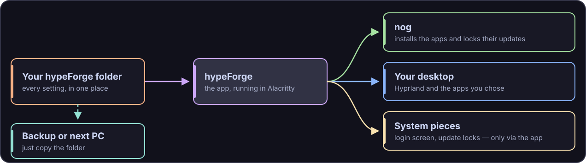
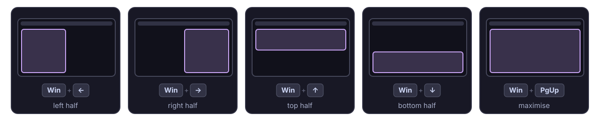

  

  
  
  
  
  
  
  

# ⚡ hypeForge

> A Forge Suite app that turns any Arch Linux install into the **KognogOS desktop, rebuilt light**. Windows float the way you're used to and snap into place with **Win + arrow keys**. The apps are small, most tools live in the terminal, and **every setting is kept in one folder** you can back up by copying it.

> 🚧 **Coming soon.** hypeForge is being **built and tested inside a KognogOS virtual machine** (Phase 2): a KognogOS disc with hypeForge as its only desktop installs and runs there today. There is no app to install yet. Follow along in [Issues](https://github.com/jetomev/hypeforge/issues) and the [roadmap](#roadmap).

> 🛡 **Security.** Every commit is GPG-signed and GitHub-Verified, and releases will be signed like the rest of the Forge Suite. **[Where We Stand](https://github.com/jetomev/KognogOS/blob/main/docs/where-we-stand.md)** explains why.

---

## Why hypeForge?

A full desktop like KDE Plasma does everything for you, and it carries a lot of weight to do it. KognogOS started on Plasma. **We are moving to something lighter.**

**Hyprland** is a *compositor*: the program that draws your windows and moves them around. It is fast, good-looking and endlessly adjustable. On its own, though, it is an empty screen. There is no top bar, no app launcher, no notifications and no lock screen. You have to pick a dozen small apps, write their settings by hand, and hope the guide you followed is still current. That hope got weaker in 2026, when Hyprland [changed its settings language to Lua](https://hypr.land/news/26_lua/) (a small, simple programming language), so most guides online now describe the old way.

**hypeForge does that assembly for you, the KognogOS way:**

- **Familiar.** Windows float by default, and **Win + arrow keys** snap them to half the screen, the same keys as Plasma.
- **Light.** Small apps and terminal tools come first.
- **Portable.** Every setting lives in **one folder**. Copying the folder backs it up, and dropping it onto a new PC sets that PC up the same way.
- **Safe.** Nothing on the system changes without the app showing you first, and everything it does can be undone.
- **Honest.** The decisions, the research and the test results are published here, including the parts that go badly.

---

## What it will do

- **Install the whole desktop through [nog](https://github.com/jetomev/nog)**, KognogOS's tier-aware package manager. It will also **lock Hyprland's family of packages together**, so they update as one group, when *we* decide they should.
- **Write every setting from your one folder.** That includes Hyprland's own Lua settings and each app's settings.
- **Make system-level changes only through the app, using our config files.** Examples are the login screen and the update locks. Nothing on the system is edited by hand.
- **Let you choose the app for each job** (top bar, launcher, notifications and so on) from a short, researched list of the most recommended options.
- **Dress everything in Catppuccin Mocha**, with the KognogOS emblem and wallpapers.
- **Undo.** It can remove what it installed and put back what was there before.
- **Run in Alacritty like every Forge app**, and **stay readable on a plain text screen**. A fresh Arch install has no desktop yet, so a text screen is where you will often start.

---

## Design principles

These were decided on the first night. Each one has a dated entry in the [decision log](docs/DECISIONS.md).

| | Principle | In plain words |
|---|---|---|
| 🪟 | **Floating first, tiling on demand** | Windows open floating, like on Windows or Plasma. **Win + arrows** snap them into place. |
| 📁 | **One portable folder** | All settings live in one folder: copy it to back up, move it to a new PC. |
| 🔐 | **System changes only through the app** | Anything outside your home folder is done by hypeForge, from our config files, never by hand. |
| 🪶 | **Light apps, terminal first** | Small, fast tools; the terminal wherever it does the job well. |
| 🔒 | **Updates locked by us** | Hyprland and its helper packages update together, through nog, when we say so. |
| 🌙 | **Lua from day one** | We write Hyprland's new settings format only. Nothing is built on the format being retired. |
| 🖥 | **Readable anywhere** | The app runs in Alacritty and stays readable on a plain text screen. |
| 🙏 | **With thanks, not comparison** | We learn from [Omarchy](https://github.com/basecamp/omarchy) and from every developer whose app we use, and we credit them. Our picks are simply ours. |

---

## How it will work

  

The folder is the source of truth. The app reads it and applies it, and nog installs what it lists. **Your backup is the folder.** The folder holds a full copy of every setting, and each computer's own details (such as its monitors) sit in a sub-folder of their own ([layout](docs/DESIGN.md#one-portable-folder)).

---

## Keys — the same as Plasma

  

| Keys | What happens |
|---|---|
| **Win + ← / →** | The window fills the left or right half of the screen |
| **Win + ↑ / ↓** | The window fills the top or bottom half |
| **Win + PgUp**, or **Win + ↑** twice | Maximise; **Win + ↓** comes back |
| **Alt + Tab** | Switch between windows |
| **Win + Shift + →** | Move the window to the next screen |
| **Alt + F4** | Close the window |

*The Win key is the one Plasma calls "Meta". Every Plasma key used today keeps its job; the [full key map](docs/DESIGN.md#the-key-map) was approved on 2026-09-29. Snapping and Win + ↑↑ are built by hypeForge; **Alt + Tab** simply jumps to the next window, with no list (D-35). There is **no minimise** in hypeForge (D-34).*

---

## The recipe — one app per job, and you choose

A bare Hyprland needs a small app for each of these jobs. For every job, the [recipe page](docs/RECIPE.md) lists **up to five of the most recommended options**. Each option has links showing how it works. Javier picks one per job.

| Things you see | Tools you use |
|---|---|
| Bar · app launcher · notifications | File manager · Wi-Fi · Bluetooth · sound |
| Lock screen · screen-off timer · wallpaper | System monitor · three-monitor setup · night light |
| Volume/brightness pop-ups · admin-password pop-up | Text editor · image, PDF and video viewers |
| Login screen · clipboard history · screenshots | Password wallet · USB auto-mount · power menu · printing |

> **Chosen, 2026-09-29, then reshaped by testing on 2026-09-30.** The first picks were separate small apps. Living in them in a VM changed the plan: settings get graphical apps, not terminal ones (D-39), and **[Noctalia](https://github.com/noctalia-dev/noctalia)** became the desktop shell (D-40): the bar (along the bottom, full width, clock in the corner, D-41), launcher, notifications, sound / network / Bluetooth menus, wallpaper and on-screen pop-ups, with our five themes as its colour schemes. Around it: Hyprland's lock screen, idle timer and password pop-up, hyprbars title bars, Monique for screen settings, the KognogOS SDDM login screen (D-38), all started through uwsm. Every pick is a first try. The reasons are in the [recipe page](docs/RECIPE.md) and the [decision log](docs/DECISIONS.md).

---

## Built for KognogOS, works on any Arch

hypeForge becomes **the KognogOS desktop**. KognogOS moves off Plasma little by little, and [what that changes](docs/KOGNOGOS-IMPACT.md) is tracked in the open. Some things carry over unchanged: nog and its tiers, the Forge apps, Alacritty with fish and Tide, the boot splash, the GRUB theme and the Catppuccin look.

It is also meant for **any Arch Linux install**. How nog comes along on a plain Arch system is designed in Phase 3.

---

## With thanks

hypeForge is built on other people's work, and we are grateful for it.

- [**Omarchy**](https://github.com/basecamp/omarchy), by DHH and Basecamp (MIT licence), taught us a great deal about turning Arch into a Hyprland desktop. Anything we adapt from it is credited and keeps its notice.
- The **Hyprland** team, for Hyprland and its family of small apps.
- The [**Noctalia**](https://github.com/noctalia-dev/noctalia) team (MIT licence), for the shell that draws most of what you see.
- **Every developer whose app is in the [recipe](docs/RECIPE.md)**: Monique, hyprbars, udiskie, Midnight Commander, superfile, Krusader, Fresh, mpv, cliamp, uwsm and all the others, and the apps we tried along the way (Waybar, Walker, mako, SwayOSD), which taught us what we needed.
- The [**Catppuccin**](https://catppuccin.com) team, for the colours everything wears.

We don't compare ourselves with anyone. Our picks are simply our picks.

---

## Roadmap

| Phase | What happens | Status |
|---|---|---|
| **0 · Foundations** | Name, repository, decisions, research; test machines (virtual machines) that can run Hyprland, including a real KognogOS install ✅ | 🔄 in progress |
| **1 · The recipe** | Choose one app per job ✅; the portable folder ✅; floating-first windows with Win + arrow snapping ✅; five themes ✅ | 🔄 in progress |
| **2 · Build it by hand** | Build the desktop in a KognogOS VM first (D-37), then on the test desktop; live in it; every rough edge becomes a finding (two test rounds so far, issue [#13](https://github.com/jetomev/hypeforge/issues/13)) | 🔄 in progress |
| **3 · The app** | The forgekit terminal app that installs, adjusts and removes it; readable on a plain text screen | ⬜ |
| **4 · Test** | Fresh virtual machines restored to a clean saved state before every run, then real hardware; published test matrix; numbered findings | ⬜ |
| **5 · Release** | GitHub Release first, then the AUR | ⬜ |

Full detail: [docs/ROADMAP.md](docs/ROADMAP.md) · History: [docs/CHANGELOG.md](docs/CHANGELOG.md)

---

## Testing

Everything is tested in **virtual machines first** (a computer running in a window). Before every run, the machine is put back to a clean saved state:

- an **Omarchy** machine, a known-good Hyprland setup that proves our test machines can run Hyprland at all
- a **real KognogOS install**, built from a freshly rebuilt KognogOS disc with hypeForge as its desktop, installed with KognogOS's own installer (working since 2026-09-30)
- a **plain Arch** install, the "any Arch" promise

Then comes real hardware: an NVIDIA RTX 3060 driving **three 1440p screens at 144 Hz**. **Every test matrix includes a run on a plain text screen.** Results are published in [`testing/`](testing/), the same way as every Forge app.

---

## Documentation

| Document | What's in it |
|---|---|
| [DECISIONS](docs/DECISIONS.md) | Every decision, dated, with who made it and why |
| [DESIGN](docs/DESIGN.md) | How it will work: the folder, the windows, the update locks |
| [RECIPE](docs/RECIPE.md) | The options for every job, with sources |
| [KOGNOGOS-IMPACT](docs/KOGNOGOS-IMPACT.md) | What moving off Plasma changes in KognogOS |
| [Research notes](docs/research/) | What was checked, how, and the sources |
| [ROADMAP](docs/ROADMAP.md) · [CHANGELOG](docs/CHANGELOG.md) | Where it's going; where it's been |
| [testing/](testing/) | The test plan, then every test matrix and its results |

---

## How this project is built

hypeForge is a human and AI collaboration. Decisions are written down the day they're made, the to-do list ([TODO.md](TODO.md)) is the handoff between work sessions, and nothing important is trusted to anyone's memory, human or AI. The method is described in [Building grubForge with AI](https://github.com/jetomev/grubforge/blob/main/docs/AI-COLLABORATION.md).

---

## Related Projects

- **[KognogOS](https://github.com/jetomev/KognogOS)** — the distribution hypeForge becomes the desktop of
- **[nog](https://github.com/jetomev/nog)** — tier-aware package manager
- **[forgekit](https://github.com/jetomev/forgekit)** — the shared foundation for the Forge apps
- **[grubForge](https://github.com/jetomev/grubforge)** — bootloader manager
- **[alacrittyForge](https://github.com/jetomev/alacrittyforge)** — terminal configurator
- **[bitlaForge](https://github.com/jetomev/bitlaforge)** — solo Bitcoin mining, honestly framed
- **[mindForge](https://github.com/jetomev/mindforge)** — a working agreement with an AI assistant that doesn't decay

---

## Authors

**jetomev** — idea, vision, direction, testing

**Claude (Anthropic)** — co-developer, architecture, research, implementation

Built as a collaboration between a human with a clear picture of the desktop he wants and an AI that helps build it, one decision at a time.

---

## License

hypeForge is free software, released under the **GNU General Public License v3.0**. See [LICENSE](LICENSE) for the full text. Anything we adapt from Omarchy keeps Omarchy's MIT notice.

---

## Contributing

hypeForge is in its first phase, and ideas and experience are welcome. Open an issue. It is especially useful to hear from people running **Hyprland with floating windows by default**, **Hyprland on NVIDIA**, or a **light, terminal-first desktop** they love.

If the idea interests you, a star helps others find it.
