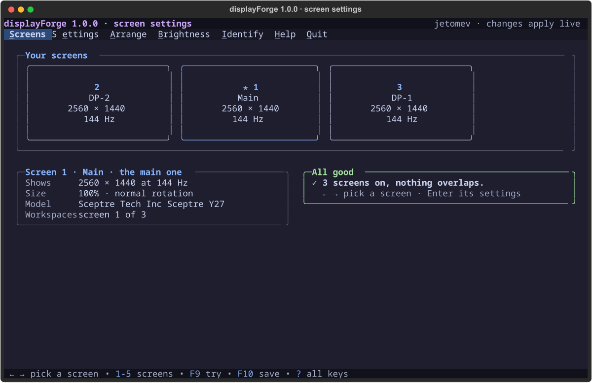
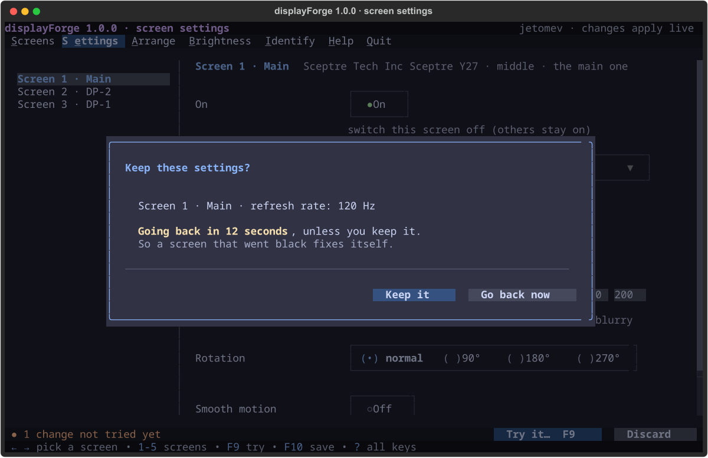
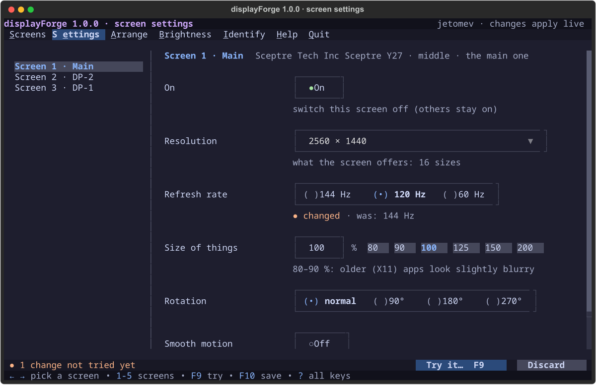
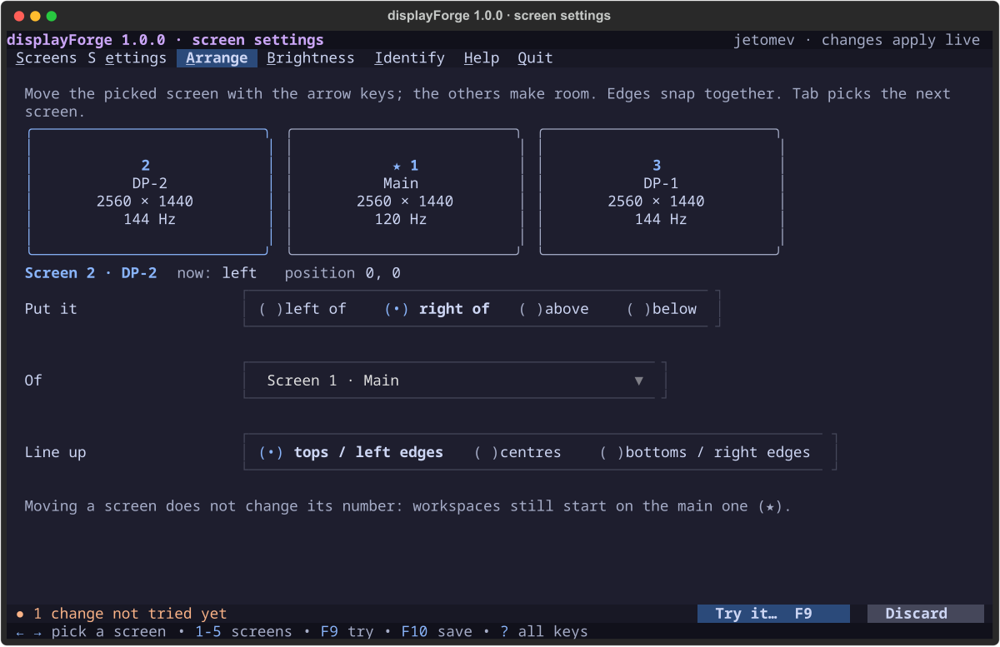
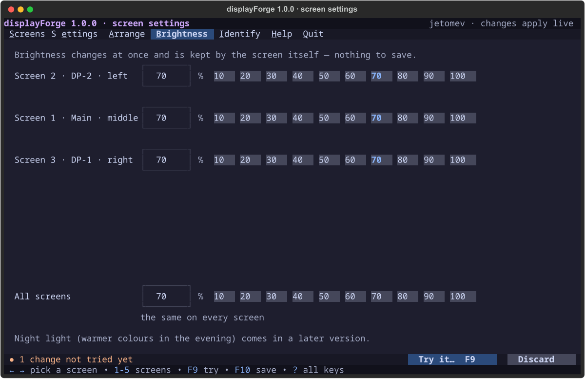

<p align="center">
  
</p>

<p align="center">
  
  
  
  
  
  
</p>

# 🖥 displayForge

> **Screen settings for the KognogOS desktop, in the terminal.** Arrange your screens, pick the resolution and refresh rate, make things bigger or smaller, rotate a screen, switch one off, set the brightness, and give your screens names. Every change comes with a **safety countdown**: if a change leaves you staring at a black screen, it goes back by itself. Part of the **[Forge Suite](../README.md)**, made for **[hypeForge](../hypeforge/README.md)**. **Works on Sway only**, and says so at launch anywhere else.

> 🖥 **Where it runs:** **the Sway desktop only** (it sets up your screens through Sway), in a terminal window there · written for **KognogOS** (Arch-based); other distributions with Sway not tried · on a plain text console it explains why and closes.

> 🛡 **Security.** Every commit is GPG-signed and GitHub-Verified. displayForge needs no password: it only writes your own files, with a backup first.

<p align="center"></p>

---

## What it does

| View | What you do there |
|---|---|
| **1 · Screens** | See your screens drawn **as they sit on your desk**, to scale, any layout. The ★ is the main screen, where your workspaces start. A green **All good**, or a list of what needs attention. |
| **2 · Settings** | Per screen: on or off, resolution, refresh rate, size of things (80 % – 200 %), rotation, smooth motion (adaptive sync), HDR where the screen has it. **Only what your screen really supports is offered.** |
| **3 · Arrange** | Move a screen with the arrow keys; the others make room and the edges snap together. Side by side, one above another, three over three: any layout. |
| **4 · Brightness** | Each screen, or all of them, in steps of ten. Changes at once; the screens keep it themselves. |
| **5 · Identify** | Same-model screens look identical to the computer. Each one goes dark for three seconds, you say which it was, and displayForge remembers. Name your screens here too. |

## The three steps for a change

1. **Change** something. Nothing happens on your screens yet.
2. **Try It (F9)**, on Settings or Arrange, the two pages that change something. The change appears, and a window asks **"Keep these settings?"** with a 12-second countdown. Do nothing and it **goes back by itself** — and that countdown runs outside displayForge, so it happens even if displayForge closes.
3. **Save (F10)** to keep it after your next login. A review of every change first, and a backup of the old file.

On the other pages, the bar at the bottom reminds you that changes are waiting and where to finish them. Quit with anything not finished and displayForge asks **"Apply your changes before quitting?"**: **Yes** tries them (with the countdown) and saves them, **No** quits without them, **Esc** stays. *(1.1.0)*

<p align="center"></p>

<details><summary>More pictures: Settings, Arrange, Brightness</summary>

<p align="center"></p>
<p align="center"></p>
<p align="center"></p>
</details>

---

## Install and run

From the AUR (since 2026-10-09):

```
yay -S displayforge
```

Then `displayforge`, or the **Screens** page of hypeForge Settings. It also runs straight from this repository.

- **Sway only.** displayForge sets up screens by talking to Sway, and only Sway. It checks at launch *(1.0.1)*: on any other desktop (KDE, GNOME, Hyprland…) or on a text console it shows one plain screen — what it needs, what it found instead, why, what to use — and closes. Nothing is touched.
- **Needs:** Sway, Python 3.11 or newer, [forgekit](../forgekit/) 0.10.0 or newer (`python-forgekit` in the AUR) and `ddcutil` (for brightness; your screens need **DDC/CI** switched on in their own menu). Without `ddcutil` the launch screen says so and lets you continue; Brightness and Identify are the two views that need it.
- **Run:** `displayforge` once installed, or `python3 displayforge/main.py` from the Forge Suite folder. In hypeForge it's in the launcher (Win + Space → "display"), opening in its own floating window.
- **Sway must read the saved file:** hypeForge's Sway settings include the line `include ~/.config/sway/outputs` after its own screen lines. displayForge warns you if that line is missing.

## Keys

| Keys | What happens |
|---|---|
| **1 – 6** | The menu, in order: 1 Screens … 5 Identify, 6 Help *(1.1.0: Help has a number too)* |
| **Ctrl + the underlined letter** | The same: **Ctrl+S** Screens, **Ctrl+E** Settings, **Ctrl+A** Arrange, **Ctrl+B** Brightness, **Ctrl+I** Identify, **Ctrl+H** Help *(1.1.0)* |
| **← →** | Pick a screen (Screens, Settings) |
| **Tab** + **arrows** | Arrange: pick a screen, then move it |
| **F9** · **F10** | Try the changes · save them (on Settings and Arrange) |
| **M** · **?** | The manual · every key |
| **Q** | Quit (asks to apply anything not finished) |

**Inside hypeForge Settings** *(1.1.0)*: Settings starts displayForge with `--hypeforge` added to its command (`--hypeForge` works too). That option is for Settings only, not for people. Started that way, displayForge has **no Quit**: Q and Ctrl+Q do nothing, because the Settings window is the one that closes. When you quit Settings, displayForge asks the same "Apply your changes?" question if anything isn't finished.

On a plain text console, **Ctrl+I** arrives as Tab (an old terminal can't tell them apart), so Identify is reached with **5** there.

## Where things are kept

| What | Where |
|---|---|
| Your saved screens | `~/.config/sway/outputs` — Sway reads it at every login |
| Backups (the last 20) | `~/.config/displayforge/backups/` |
| Names, and which brightness control is which screen | `~/.config/displayforge/screens.toml` |

---

## Known limits in 1.1.0

Said plainly, so nobody finds out the hard way:
- **Tested on one setup:** three identical 1440p screens on NVIDIA. One- and two-screen setups, the 80 / 90 % sizes on real apps and a plain text console are **not tested yet**; they come next, and anything they find becomes a 1.0.x fix.
- **Arrange** is still being tried by Javier on the real screens.
- No profiles yet (a layout that switches by itself when a screen is plugged in), and no night light.

---

## Roadmap

| Version | What | Status |
|---|---|---|
| **1.1.x** | The tests above: 1 and 2 screens, 80 / 90 %, text console; Javier's Arrange run | ⬜ next |
| **1.2** | Profiles | ⬜ |
| **AUR** | `yay -S displayforge` — 1.1.0 packaged 2026-10-09 (Javier: all ready apps on the AUR) | ✅ |
| **1.1.0** | Javier's run inside hypeForge Settings: Ctrl + every underlined letter, Help numbered, "1-6 menu"; Try and Save only where things change; a real "Apply your changes?" before quitting; the Save button in the bar works; `--hypeforge`; button labels as "Try It (F9)" | ✅ 2026-10-08 |
| **1.0.1** | Sway only, said everywhere and checked at launch (on forgekit 0.7.0's start-up check) | ✅ 2026-10-06 |

Full detail: [docs/ROADMAP.md](docs/ROADMAP.md) · History: [docs/CHANGELOG.md](docs/CHANGELOG.md)

---

## Documentation

| Document | What's in it |
|---|---|
| [DECISIONS](docs/DECISIONS.md) | Every decision, dated, who made it and why |
| [TODO](TODO.md) | What is done and what comes next |
| [Design](docs/design/) | The screen drawings Javier approved before any code |
| [Research](docs/research/2026-10-05-displayforge.md) | Sway's screen settings, brightness without a password, why identical screens need Identify |
| [testing/](testing/) | The test plan and results for every version |
| The manual | Inside the app: **M** |

---

## How this project is built

displayForge is a human and AI collaboration. The design was drawn and approved screen by screen before a line of code; decisions are written down the day they're made; every finding from a real run is numbered, fixed, and turned into a test so it can't come back.

**jetomev** — idea, direction, testing · **Claude (Anthropic)** — co-developer, design, implementation

## With thanks

To the **[Sway](https://swaywm.org)** team, whose `output` commands do the real work; to **[ddcutil](https://www.ddcutil.com)** by Sanford Rockowitz, which talks to the screens; to **[Textual](https://textual.textualize.io)**; and to **[Catppuccin](https://catppuccin.com)** for the colours.

## License

Free software under the **GNU General Public License v3.0** — see [LICENSE](../LICENSE).
