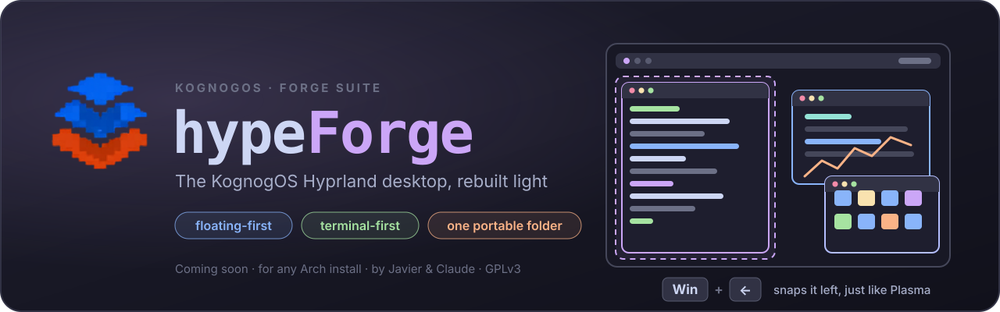

  

  
  
  
  
  
  
  

# ⚡ hypeForge

> 🧰 **Part of the [Forge Suite](../README.md)** — one repository for every Forge app; hypeForge is its first section ([D-60](docs/DECISIONS.md)).

> **The KognogOS desktop: slim, quick, low on memory.** hypeForge turns any Arch Linux install into a **tiling** desktop on **[Sway](https://swaywm.org)**: windows arrange themselves side by side instead of piling up, all your screens move together as one, and **terminal apps come first**. Every feature is a small piece of its own, and every setting will have its own **Forge Suite app**, all opened from one control centre: **hypeForge Settings**.

> 🚧 **Being built, and lived in.** Since 4 October 2026 hypeForge runs as its own login on the KognogOS test desktop, next to the old desktop, and Javier works in it every day. There is no app to install yet. Follow along in [Issues](https://github.com/jetomev/forge-suite/issues), the [to-do list](TODO.md) and the [decision log](docs/DECISIONS.md).

> 🛡 **Security.** Every commit is GPG-signed and GitHub-Verified, and releases will be signed like the rest of the Forge Suite. **[Where We Stand](https://github.com/jetomev/KognogOS/blob/main/docs/where-we-stand.md)** explains why.

---

## Why hypeForge?

A full desktop like KDE Plasma does everything for you, and it carries a lot of weight to do it. KognogOS started on Plasma. **KognogOS will ship with hypeForge only** ([D-56](docs/DECISIONS.md)).

**Sway** is a *tiling window manager*: the program that draws your windows and places them for you, side by side, so nothing hides behind anything else. It is fast, stable, light on memory and works well on NVIDIA. On its own, though, it is a bare screen: no top bar, no launcher, no lock screen. hypeForge builds the rest, one small piece at a time, under one rule ([D-57](docs/DECISIONS.md)):

| | The rule | In plain words |
|---|---|---|
| 1 | **Terminal first** | If a job can be done by a terminal app (a text-based app), that is the one we use. |
| 2 | **Works with Sway** | Sway's own tools first; nothing that brings a whole other desktop along with it. |
| 3 | **Smallest install** | The fewest packages and the smallest download that do the job well. |

---

## What works today

| Piece | What it does |
|---|---|
| **The top bar** | A menu bar on every screen. Left: the **KognogOS emblem** (the launcher), **Workspaces** and **Favorites** menus. Middle: your open apps (click to jump to one). Right: tray · clipboard (with a count of new copies) · USB drives · Bluetooth · network · volume, then the clock, the notification bell (with a count; right click: Do Not Disturb) and **⏻** for lock, log out, reboot and shut down. |
| **Workspaces** | Six workspaces (Daily, Work, Entertainment, Gaming, Monitoring, Settings). **Win + 1…6** or the **Workspaces** menu (Win + W) switches every screen together. A screen can keep one space for several workspaces, so its apps stay put. |
| **Window placement** | Every new window goes to the next spot of a fixed order across your screens, then becomes a tab. |
| **Launcher** (Win + Space, or the emblem) | Apps only: your favourites first, then the **standard groups** every desktop uses (Internet, Office, Games, Settings, Utilities…), each app where its own entry says it belongs; picked from a group, it opens on its workspace (Internet on Daily, Games on Gaming…). **Settings** starts with hypeForge Settings. Press again to close. |
| **Favorites** (Win + F) | Your favourite apps with their icons, one click away. |
| **Passwords** — [sudoForge](../sudoforge/README.md)  | One box for every admin request: an app asking for admin rights or a `sudo -A` command. It floats up on the screen you are using and says who is asking and what for. Starts at login. |
| **Screens** — [displayForge](../displayforge/README.md)  | Arrange your screens, resolution, refresh rate, size, rotation, brightness, with a countdown that undoes a bad change by itself. The first Forge app built for hypeForge. |
| **Sound, network, Bluetooth** | Click the bar: **wiremix** (volume per app and device), a network list (with **nmtui** for the details), **bluetui**. Each opens floating, in the KognogOS colours. |
| **USB drives** | Plugged-in drives mount by themselves (Windows drives read-only, the computer's own disks never); the bar icon lists them, to open in Midnight Commander or eject. |
| **Window rules** | Small tools (the calculator, settings windows, picture-in-picture video, password boxes) float above the tiled windows. |
| **Help & Keys** (Win + F1) | A small Forge app with tabs: the key chart and a plain-words guide to every piece. The chart is checked against Sway's real keys before every change is saved. Each tab has a number and a Ctrl + letter. |
| **Lock screen** (Win + Escape) | A big clock and a password box over the blurred KognogOS wallpaper. Locks by itself after 30 minutes; the screens turn off after 60. |
| **Notifications** | Small pop-ups at the top right of the screen you're using; **Win + N** closes them all. |
| **Clipboard history** (Win + C) | Everything you copy, text and pictures; passwords from password managers are skipped. |
| **Screenshots** | **Print** drags a box; Shift / Ctrl / Alt + Print take this screen, every screen, this window. Saved, copied, and one click away from drawing on them. |
| **Terminal apps** | Alacritty for the terminal, Midnight Commander for files (in our KognogOS Mocha look, editing in Fresh), Fresh for text, cliamp for music (from the media server); galculator for sums until our own calculator. |

The look is **Catppuccin Mocha** with the KognogOS wallpaper: thin borders, no title bars, windows that share a space become tabs, 10 px between windows. Every colour and file is written down in [THEME.md](docs/THEME.md).

---

## Keys

| Keys | What happens |
|---|---|
| **Win + Space** | The launcher |
| **Win + Enter** | A terminal |
| **Win + W** · **Win + F** | The Workspaces menu · the Favorites menu |
| **Win + 1 … 6** | Switch every screen to that workspace |
| **Win + Shift + 1 … 6** | Send the window to that workspace |
| **Win + arrows** | Move between windows (also across screens); add **Shift** to move the window |
| **Win + T / S / E** | Tabs · stacked · side by side |
| **Win + Shift + F** | Full screen |
| **Win + Shift + Space** | Float the window, or put it back in its spot |
| **Win + C** · **Win + N** | Clipboard history · close the notifications |
| **Print** | Screenshot (Shift, Ctrl, Alt + Print: screen, all screens, window) |
| **Alt + F4** | Close the window |
| **Win + Escape** | Lock the screen |
| **Win + F1** | Help & Keys: every key, and the guide |

*The Win key is the one Plasma calls "Meta". The full chart lives in [`applets/help/keys.toml`](applets/help/keys.toml) and in Win + F1.*

---

## How it fits together

1. **The pieces.** Each feature (workspaces, placement, launcher, rules, help, lock…) is its own small piece ([D-47](docs/DECISIONS.md)), with its own settings file in `~/.config/hypeforge/applets/`.
2. **A Forge app for every setting.** Everything that today can only be set up by editing a file gets its own **Forge Suite app**: our own pieces, and outside programs like the music player, the top bar and the launcher's look ([D-59](docs/DECISIONS.md)). Each is a full app that also runs on its own, built on [forgekit](../forgekit/README.md) so they all look and work the same. The first two are done: **[displayForge](../displayforge/README.md)** (screens) and **[sudoForge](../sudoforge/README.md)** (passwords).
3. **hypeForge Settings, the control centre.** One window, like KDE's System Settings: the list on the left, and the chosen Forge app running on the right. Replace one app and nothing else has to change. It opens on a **Home** page: a card per part of the system with how it's set up right now. Inside it, every app runs **without a Quit of its own** (Settings starts it with `--hypeforge`): Settings' Quit closes them all, and an app with unsaved work asks you first.
4. **nog** installs everything and decides when it updates, and system changes are made only through the apps, never by hand.

The Forge apps already shipped, [grubForge](https://github.com/jetomev/grubforge) and [alacrittyForge](https://github.com/jetomev/alacrittyforge), will be opened from hypeForge Settings too. The full list of upcoming apps is in the [to-do list](TODO.md).

---

## Built for KognogOS, works on any Arch

hypeForge becomes **the KognogOS desktop**, and KognogOS will ship with it alone. Some things carry over unchanged: nog and its tiers, the Forge apps, Alacritty with fish, the boot splash, the GRUB theme and the Catppuccin look. It is also meant for **any Arch Linux install**.

---

## With thanks

hypeForge is built on other people's work, and we are grateful for it.

- The **[Sway](https://swaywm.org)** team and the wlroots developers, for the ground everything stands on.
- **Every developer whose app hypeForge uses**: Waybar, fuzzel, mako, gtklock, swayidle, swaybg, cliphist, grim, slurp, swappy, udiskie, wiremix, bluetui, networkmanager-dmenu, ddcutil, Alacritty, Midnight Commander, Fresh, cliamp, galculator, and all the others.
- The [**Catppuccin**](https://catppuccin.com) team, for the colours everything wears.

We don't compare ourselves with anyone. Our picks are simply our picks.

---

## Roadmap

| Step | What happens | Status |
|---|---|---|
| **Choose the base** | Research, then **Sway** chosen ([D-45](docs/DECISIONS.md)); runs on the test desktop | ✅ |
| **The jobs, one by one** | Workspaces, placement, launcher, rules, help, lock screen, notifications, screenshots, clipboard history, the menu bar, sound, network, Bluetooth, USB drives, the password pop-up (sudoForge) ✅ · next: printing, night light | 🔄 in progress |
| **Our own look** | Folder-style tabs, our own top bar, a palette from the KognogOS brand | ⬜ |
| **The Forge apps** | One Forge Suite app per setting, and **hypeForge Settings** to hold them all. **displayForge 1.0 (screens) ✅** · **sudoForge 1.0 (passwords) ✅** · next: workspaces and window placement, flexible for any number of screens | 🔄 in progress |
| **The first KognogOS release** | KognogOS ships with hypeForge as its only desktop | ⬜ |

Full detail: [docs/ROADMAP.md](docs/ROADMAP.md) · History: [docs/CHANGELOG.md](docs/CHANGELOG.md)

---

## Testing

Every step is tested on the KognogOS test desktop first, where Javier lives in it daily: an NVIDIA RTX 3060 driving three 1440p screens at 144 Hz. That is one setup among many: hypeForge is meant for **one screen or many**, and the screen setups people really use (one, two, four, six…) will be tested as the screen and workspace apps are built. Each finding gets a number (F-1, F-2…) and an [issue](https://github.com/jetomev/forge-suite/issues). Test plans and results are published in [`testing/`](testing/). Virtual machines (a KognogOS install, a plain Arch install) follow before any release.

---

## Documentation

| Document | What's in it |
|---|---|
| [DECISIONS](docs/DECISIONS.md) | Every decision, dated, with who made it and why |
| [TODO](TODO.md) | What is done and what comes next, step by step |
| [THEME](docs/THEME.md) | The look, piece by piece: every file, its values, and why |
| [FONTS](docs/FONTS.md) | Every font hypeForge needs, and which package brings it |
| [Research notes](docs/research/) | What was checked, how, and the sources |
| [ROADMAP](docs/ROADMAP.md) · [CHANGELOG](docs/CHANGELOG.md) | Where it's going; where it's been |
| [testing/](testing/) | Every test plan and its results |

---

## How this project is built

hypeForge is a human and AI collaboration. Decisions are written down the day they're made, the to-do list ([TODO.md](TODO.md)) is the handoff between work sessions, and nothing important is trusted to anyone's memory, human or AI. The method is described in [Building grubForge with AI](https://github.com/jetomev/grubforge/blob/main/docs/AI-COLLABORATION.md).

---

## Related Projects

- **[KognogOS](https://github.com/jetomev/KognogOS)** — the distribution hypeForge becomes the desktop of
- **[nog](https://github.com/jetomev/nog)**  — tier-aware package manager
- **[sudoForge](../sudoforge/README.md)**  — the password box, in this repository
- **[displayForge](../displayforge/README.md)**  — screen settings, in this repository
- **[forgekit](../forgekit/README.md)**  — the shared foundation for the Forge apps
- **[grubForge](https://github.com/jetomev/grubforge)**  — bootloader manager
- **[alacrittyForge](https://github.com/jetomev/alacrittyforge)**  — terminal configurator
- **[bitlaForge](https://github.com/jetomev/bitlaforge)**  — solo Bitcoin mining, honestly framed
- **[nogForge](https://github.com/jetomev/nogforge)**  — apps through nog, in a window
- **[mindForge](https://github.com/jetomev/mindforge)** — a working agreement with an AI assistant that doesn't decay

---

## Authors

**jetomev** — idea, vision, direction, testing

**Claude (Anthropic)** — co-developer, architecture, research, implementation

Built as a collaboration between a human with a clear picture of the desktop he wants and an AI that helps build it, one decision at a time.

---

## License

hypeForge is free software, released under the **GNU General Public License v3.0**. See [LICENSE](LICENSE) for the full text. Anything we adapt from another project keeps that project's notice.

---

## Contributing

hypeForge is being built in the open, and ideas and experience are welcome. Open an issue. It is especially useful to hear from people running **Sway on NVIDIA**, **Sway across several screens**, or a **light, terminal-first desktop** they love.

If the idea interests you, a star helps others find it.
