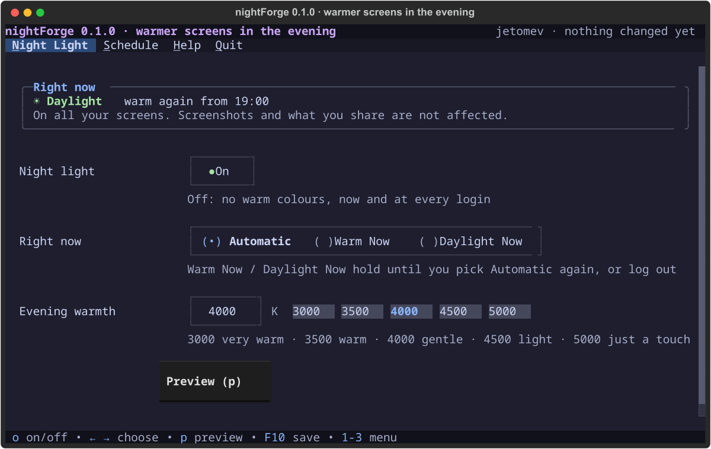
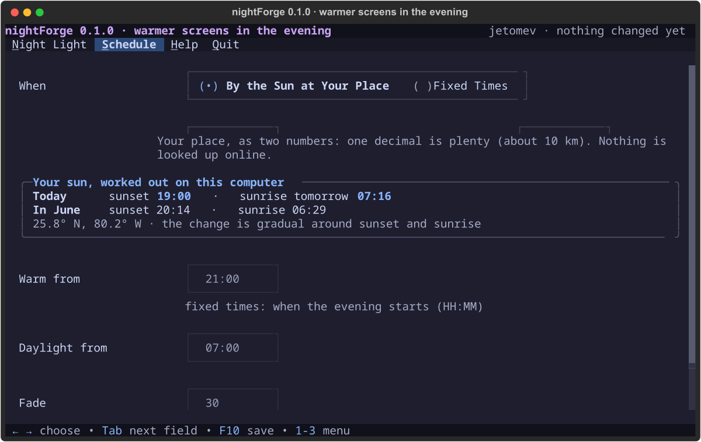

  

  
  
  

# nightForge

**Warmer screens in the evening, your way.** The night light's own app: switch it on or off, choose how warm the evening gets, and when (by the sun at your place, or fixed times). A terminal app, and the Night light page of hypeForge Settings.

> 🖥 **Where it runs:** made for **KognogOS's hypeForge desktop on Sway** (the night light, wlsunset, works on Sway and its wlroots family, not on KDE or GNOME) · **any terminal, even a plain text console**, where it edits the settings for the next login · written for KognogOS; needs Python, Textual, forgekit and wlsunset.

## How it looks

| Night Light | Schedule |
|---|---|
|  |  |

## Status

**Being built, 0.1.0 (2026-10-09).** Design approved (D-3) with a tray icon (D-4). Runs from the repository (`python3 main.py`), as the Night light page of hypeForge Settings, and at login (`nightforge start`). Not packaged yet. Javier's issue: [#44](https://github.com/jetomev/forge-suite/issues/44). The design: [docs/design/](docs/design/) · decisions: [docs/DECISIONS.md](docs/DECISIONS.md) · the list: [TODO.md](TODO.md).

## License & credits

GPLv3. Built by Javier and Claude, part of the [Forge Suite](../), on [forgekit](../forgekit/). The night light itself is [wlsunset](https://sr.ht/~kennylevinsen/wlsunset/) by Kenny Levinsen; the sun times use NOAA's solar calculator formulas. Thank you both.
