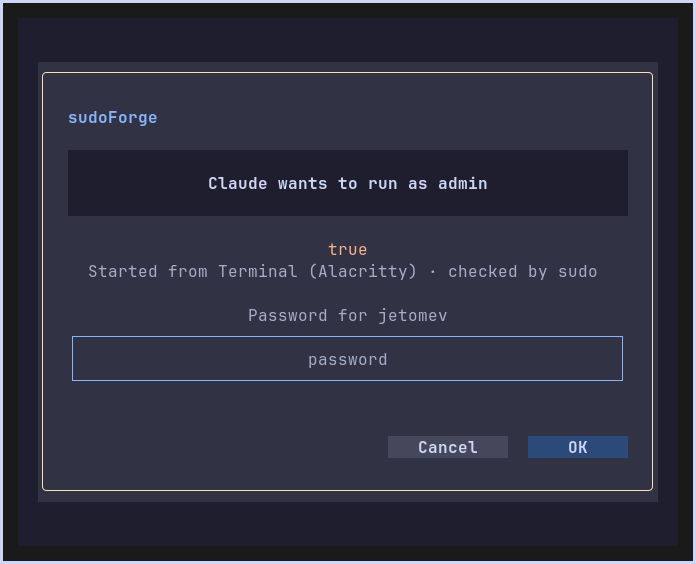

  

  
  
  
  
  

# 🔑 sudoForge

> **One password box for every admin request on the KognogOS desktop.** When something needs admin rights (an app changing the printer settings, a `sudo -A` command, nog started from the launcher), a small box floats up in the middle of the screen you are using. It says **who is asking and what for**, in plain words, and asks for your password. Part of the **[Forge Suite](../README.md)**, made for **[hypeForge](../hypeforge/README.md)** on **Sway**.

> 🖥 **Where it runs:** **the Sway desktop only** (KognogOS's desktop; its box opens in an Alacritty window) · written for **KognogOS** (Arch-based); other distributions with Sway not tried · **not for a plain text console**.

> 🛡 **Security.** Every commit is GPG-signed and GitHub-Verified. Your password goes only to the part of the system that checks it (polkit or sudo). sudoForge never keeps it, never writes it anywhere and never gets admin rights itself.

---

## Why it exists

A desktop needs someone to ask for your password when a program wants admin rights. KDE and GNOME bring their own; **Sway has none**, so on a plain Sway desktop those requests simply fail, without a word. KognogOS ships with Sway only, so we made our own, in the same look as every Forge app ([hypeForge D-56](../hypeforge/docs/DECISIONS.md)).

## What it answers

| Who asks | How it reaches sudoForge | What the box shows |
|---|---|---|
| **An app** wanting admin rights (printer settings, system services, `pkexec`…) | polkit, the system's permission service: sudoForge answers for your whole login session | "**Printers** wants admin rights", the system's own sentence ("To add the printer…"), who asked |
| **`sudo -A`**, nog started without a terminal, scripts | sudo's own settings name sudoForge's helper (`sudoforge setup`) | "**nog** wants to run as admin", the exact command in orange, where it was started |

In a terminal, `sudo` and nog keep asking right there in the terminal ([D-4](docs/DECISIONS.md)). The box is for everything that has no terminal to ask in.

## Using the box

- Type your password: **only dots show**, centred.
- **Enter** = OK, **Esc** = Cancel. Cancel means nothing runs.
- A wrong password says so in yellow, with **try 2 of 3** at the top.
- **One box at a time:** a second request waits until the first is answered.

## Install and run

- **Install:** `nog install sudoforge` on KognogOS (or `sudoforge` from the AUR). Then once: `sudoforge setup`.

- **Needs:** Sway, Python 3.11 or newer, [forgekit](../forgekit/) **0.8.0** or newer (`python-forgekit` in the AUR), `python-gobject` and `polkit` (for the admin pop-up), Alacritty (the box's window).
- **Started at login** by hypeForge's Sway settings (`exec sudoforge service`); its window floats and centres by hypeForge's window rules.
- **Commands:**

| Command | What it does |
|---|---|
| `sudoforge status` | Is it running, and does `sudo -A` use it? |
| `sudoforge setup` | Makes `sudo -A` ask in the box: two marked lines in `/etc/sudo.conf`, a backup first. Asks for your password once, in the box itself. |
| `sudoforge undo` | Takes those two lines back out; everything else in the file stays. |
| `sudoforge service` | The background part (hypeForge starts it). Its record: `~/.local/state/sudoforge/service.log`, never a password. |

## Coming later

- **The keyring:** saved logins for Claude Desktop, Chrome and Discord on Sway (today they are kept as plain text and lost on restart).
- **GPG's passphrase in the same box:** signing a commit asks through GPG's own window (pinentry); a sudoForge pinentry would ask in our box and drop a GNOME piece.

## How it works, briefly

A background service with no window holds two doors: a **polkit agent registered for your login session**, and a **private socket** only your account can reach, which the sudo helper uses (sudoForge checks the caller really is sudo). For each question it opens the box in its own small terminal window, passes it the question over a one-time socket, and hands the answer straight on. polkit's own checker and sudo decide whether the password is right. Details: [the research](docs/research/2026-10-06-sudoforge.md).

## Status

**1.0.1, released 7 October 2026.** One fix, F-2 ([#37](https://github.com/jetomev/forge-suite/issues/37)): the backup of `/etc/sudo.conf` is now the file from before sudoForge ever touched it, and a second `sudoforge setup` keeps it. 38 tests.

**1.0.0, released 6 October 2026.** Proven live on the test desktop before release: `sudo -A` with the right password, wrong passwords (try 2, try 3, then right), Esc, two requests at once; the admin pop-up through Print Settings (unlock and cancel) and `sudoforge setup` / `undo`; the service starting by itself after a reboot. Results: [testing/](testing/). Roadmap: [docs/ROADMAP.md](docs/ROADMAP.md) · changes: [docs/CHANGELOG.md](docs/CHANGELOG.md) · decisions: [docs/DECISIONS.md](docs/DECISIONS.md).

## License & credits

GPLv3. Built by Javier and Claude, together. The admin pop-up's agent is adapted from [forgekit](../forgekit/)'s in-app agent; colours from [Catppuccin](https://catppuccin.com) (thank you).
