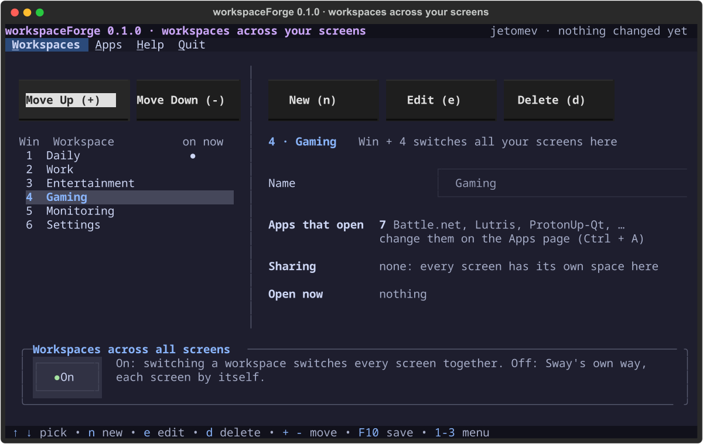
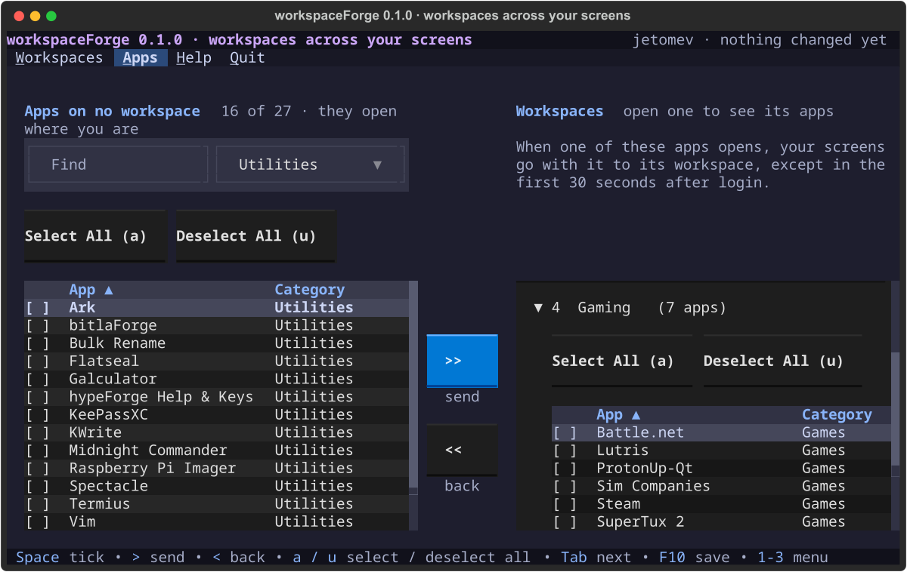

  

  
  
  
  

# workspaceForge

**Your workspaces, in the terminal.** On the KognogOS desktop a workspace covers all your screens at once: Win + 4 takes every screen to Gaming. workspaceForge is where you set them up: their names and order, **which apps open on each one** (however you start them). Today all of that lives in a settings file edited by hand; workspaceForge is the friendly way in.

## What it does

- **Workspaces:** name them, add up to nine for now (Win + 1 … 9), reorder, delete. Deleting one never closes a window; its windows move to a workspace you pick.
- **Apps:** each workspace has a list of the apps that open on it. Steam on Gaming, Spotify on Entertainment. Start an app from the launcher, a terminal or Steam itself, and it opens on its workspace, with your screens following it. Apps on no list open where you are.
- **Sharing** (a screen keeping the same apps across workspaces) is being rethought by Javier and comes back later; the file's sharing is kept as it is.
- **Saves with a review**, a backup first, and applies at once. No logout.

It does **one** job on purpose: where windows sit on a screen and which ones float is a separate Forge app.

## How it looks

| Workspaces | Apps |
|---|---|
|  |  |

## Status

**Being built, 0.1.0 (2026-10-09).** Design approved the same morning (D-5); the engine (apps open on their own workspace) is live in hypeForge; the app runs from the repository (`python3 main.py`) and as the **Workspaces** page of hypeForge Settings. Not packaged yet. Javier: *"Why don't we work on workspaceForge already. It is HOT topic xD"*. The design, screen by screen: [docs/design/](docs/design/) · decisions: [docs/DECISIONS.md](docs/DECISIONS.md) · the list: [TODO.md](TODO.md).

## License & credits

GPLv3. Built by Javier and Claude, part of the [Forge Suite](../), on [forgekit](../forgekit/). The work itself is done by hypeForge's Workspaces applet; thanks to the Sway project, whose workspaces and IPC make all of it possible.
